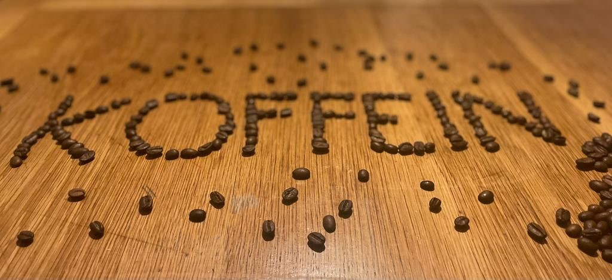
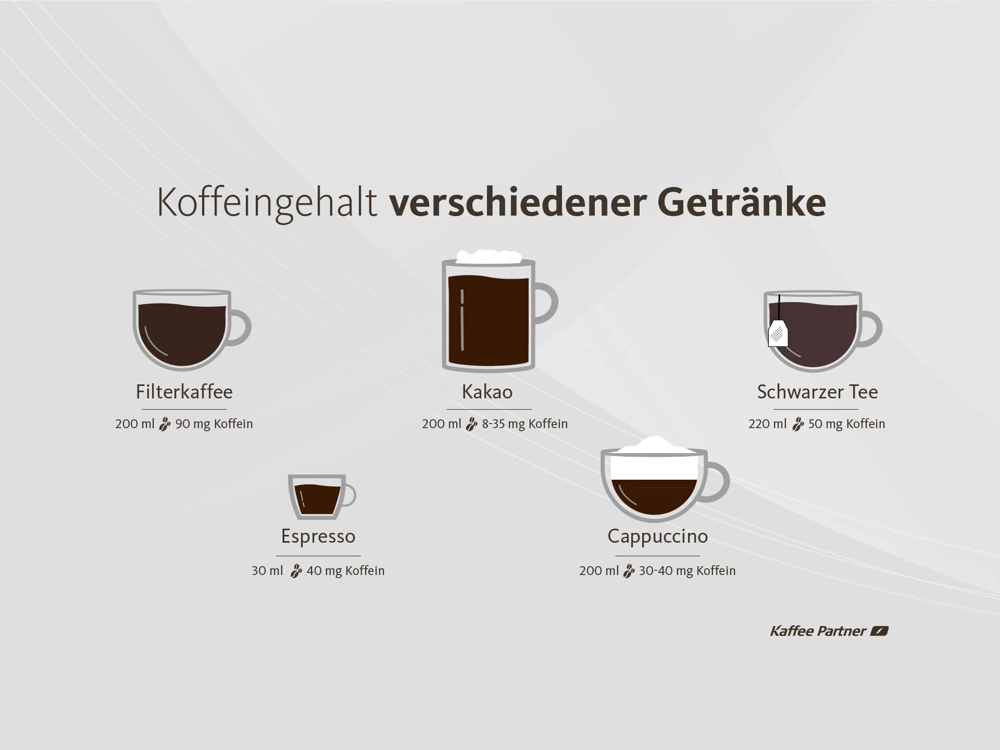

+++
title = "Koffein: Der versteckte Feind in deiner Tasse?"
date = "2023-06-02"
draft = false
pinned = true
tags = []
image = "1-1267462282conq.jpg"
description = ""
+++
**Kaffee, Energy-Drinks und Cola sind aus unserem Alltag kaum wegzudenken. Heutzutage trinken immer mehr Menschen koffeinhaltige Getränke, doch immer wieder hört man Sätze wie: Es führt zu Herzrhythmusstörung, es trocknet aus, es ist schädlich. Vor einigen Jahren verstarb sogar ein gesunder 16-Jähriger in den USA, als er nur drei koffeinhaltige Getränke innerhalb von zwei Stunden zu sich nahm. Also stellen wir uns die Frage: Ist Koffeinkonsum wirklich unbedenklich?** 

**Von Théo Sauvain und Louis Luyet**

## **Koffein: Das meistkonsumierte Stimulans der Welt**

Es ist 6:40 Uhr und der Betroffene Herr Niquille schafft es nicht ohne ein koffeinhaltiges Getränk in den Tag zu starten. Jeremy Niquille arbeitet für das Bundesamt für Sozialversicherungen und ist starker Koffeinkonsument. Wir treffen ihn im Spitalackerpark, um ein Interview mit ihm zu führen. Doch was ist dieses ominöse Koffein, welches in vielen beliebten Getränken der Menschen vorhanden ist? Um diese Frage zu beantworten, suchen wir heute den Rat des Experten Herrn Hagmann. Er ist Kardiologe an der Kardiologischen Praxis Kirchenfeld und hat des Öfteren Patienten zu behandeln, deren Leiden mit Koffein in Verbindung steht. 

Koffein, auch als Teein bekannt, ist ein Alkaloid und wirkt beim Menschen stimulierend. Es ist in über 60 Pflanzen enthalten und entsprechend in vielen Nahrungsmitteln vorzufinden, vor allem in Getränken. So enthält eine Tasse Kaffee 30 – 100 mg, ein Energy-Drink 80 mg / Dose und 100 g dunkle Schokolade 90 mg Koffein. Pro Tag sollte man maximal 400 mg Koffein zu sich nehmen. Wenn Sie jetzt rechnen, wie viel Kaffee oder Energy-Drinks Sie pro Tag trinken, merken Sie vielleicht, dass 400 mg pro Tag schnell erreicht sind. Doch was macht ein übermässiger Konsum mit uns und bist du Koffein-abhängig? Zu diesen Fragen später mehr, denn um zu verstehen, ob jemand abhängig ist, muss man erst wissen, wie genau der Stoff wirkt. 

## **Koffein und seine Wirkung im Gehirn**

Grundlegend für die wach machende Wirkung von Koffein ist dessen chemischer Aufbau. Dieser ähnelt nämlich dem Botenstoff Adenosin. Adenosin ist ein Botenstoff in unserem Körper, welcher durch Andocken an seine Rezeptoren im Gehirn uns das Gefühl von Müdigkeit vermittelt. Durch die Ähnlichkeit ist das Koffein Molekül imstande an die Adenosin-Rezeptoren im Hirn anzudocken und diese für Adenosin selbst zu blockieren. Je nach Menge an Koffein, die man zu sich genommen hat, dauert es kürzer oder länger, bis das Koffein die Rezeptoren wieder freigibt und Adenosin seine Stelle einnehmen kann. Wenn ich am Nachmittag oder Abend einen Kaffee trinke, um besser zu lernen, dann liege ich einige Stunden später müde im Bett, kann jedoch aufgrund der Wirkung des Kaffees nicht einschlafen. Irgendwann gelingt es dann doch, obwohl eigentlich meine Rezeptoren noch blockiert sein sollten. Dies liegt daran, dass der Körper mehr Adenosin produziert und dieses dann die blockierenden Moleküle «vertreibt». Anderseits trinken meine Eltern jeden Abend vor dem Schlafen einen Kaffee und haben keine Schlafbeschwerden. Das liegt an der Tachyphylaxie des Koffeins, der Toleranzentwicklung. Das heisst, dass Menschen, die viel Koffein konsumieren, eine höhere Dosis benötigen, um dieselbe Wirkung zu erhalten. 

## **Warum Menschen so viele koffeinhaltige Getränke trinken**

Fast jeden Morgen auf dem Weg zur Schule sieht man draussen oder im Bus Jugendliche mit einem Energie-Drink in der Hand, dieses Phänomen kommt immer öfters zum Vorschein. Der Kardiologe Herr Hagmann berichtet, dass einer der Hauptgründe dafür das Muntermachen sei, da wie bereits erwähnt Koffein das Adenosin im Gehirn verdrängt. Dadurch unterdrücken die Schüler ihre Müdigkeit, was zu erhöhter Stimmung, Aufmerksamkeit und Konzentrationsvermögen am frühen Morgen führt. Ausserdem steigert Koffein die Geschwindigkeit des Denkens, erleichtert das Lernen und verbessert das Langzeitgedächtnis. 
Dies ist nicht nur bei den Jugendlichen der Fall, sondern auch bei vielen erwachsenen Personen, wie uns Niquille bestätigte. «*Ich trinke eigentlich fast jeden Morgen Kaffee, es ist jetzt schon seit langem ein Morgenritual, ich werde dadurch direkt wach*». Doch das Muntermachen ist nicht der einzige Grund, warum Erwachsene im Durchschnitt etwa 238 mg Koffein pro Tag zu sich nehmen. 

Wir fragen einen weiteren Betroffenen des Koffeinkonsums im Schulhaus Kirchenfeld, Herrn Rytz. Er ist Physik- und Mathematiklehrer am Gymnasium Kirchenfeld und Koffeinkonsument, verdeutlicht wird das, indem er einen grossen Sack mit Kaffeesätzen bei sich trägt. Er erklärt uns, wie sein Kaffeekonsum entstand «*Es wurde zu einer Art Gewohnheit. Seit ich das Gymnasium besucht habe, trinke ich jeden Tag Kaffee. Manche Menschen lesen sonntags die Zeitung, ich trinke jeden Tag einen Espresso.*» 
Manche Sportler benutzen Koffein auch als Aufputschmittel vor sportlichen Aktivitäten. Es hilft ihnen, ihre Leistung zu steigern und bei der Gewichtsabnahme, da Koffein den Stoffwechsel antreiben kann und die Fettverbrennung daher fördert. Dazu gibt es auch Hinweise darauf, dass Kaffee einige gesundheitliche Vorteile haben kann, wie beispielsweise einen Schutz vor Diabetes und Lebererkrankungen. 
Oft hört man aber auch Sätze wie: Koffeinkonsum hilft gegen den Haarausfall. Doch die Wissenschaft ist sich dabei sehr uneinig. Einige Studien deuten darauf hin, dass Koffein tatsächlich positive Auswirkungen auf das Haarwachstum haben kann. Eine Untersuchung an der Universität Lübeck ergab, dass Koffein das Wachstum der Haarfollikel anregen kann, indem es die Zellteilung und die Produktion von Wachstumsfaktoren stimuliert. Allerdings gibt es auch viele Experten, die skeptisch sind und betonen, dass weitere Untersuchungen nötig sind, um den genauen Zusammenhang zwischen Koffein und Haarausfall zu verstehen. Einige befürchten sogar, dass ein übermässiger Konsum von Koffein das Problem eher verschlimmern als verbessern könnte, indem er den Körper unnötig belastet und möglicherweise den Hormonhaushalt durcheinanderbringt. Es ist also sicherlich verfrüht, Koffein als Heilmittel gegen Haarausfall zu preisen.
Natürlich trinken viele weitere Menschen Koffein als Genussmittel. Sie mögen einfach den Geschmack von Kaffee oder Tee und trinken koffeinhaltige Getränke aus Freude daran. Doch Vorsicht: Koffein kann auch negative Auswirkungen auf unseren Körper haben, besonders wenn es in grossen Mengen konsumiert wird. Es ist daher wichtig, den Konsum von koffeinhaltigen Getränken im Rahmen zu halten und sich bewusst zu machen, wie viel Koffein man zu sich nimmt.

## **Die dunkle Seite des Koffeins**

«*Heute Vormittag habe ich 6 Kaffees getrunken*» - Jeremy Niquille 

Dies können wohl nur die wenigsten von uns behaupten. Dass solch ein übermässiger Konsum nicht gesund sein kann, sollte den meisten bewusst sein. Doch was genau ist schädlich am Koffeinkonsum und ab welcher Menge macht er sich bemerkbar?
«*Das unabweisbare Verlangen nach einem bestimmten Erlebniszustand*» - so definiert man Sucht. Ist die Wirkung des Koffeins stark genug, um ihre Wirkung auf die Menschen als Erlebniszustand zu beschreiben? Wir fragen den Spezialisten Dr. Andreas Hagmann.
Er erklärt uns, dass Koffeinsucht sehr wohl existiert, sie ist bekannt als Koffeinismus oder auch Kaffeesucht. Wenn im Gehirn die Koffeinmoleküle die Rezeptoren besetzen, dann produzieren die Nervenzellen mehr Adenosin, um diese zu lösen. Beim nächsten Mal, wenn die stimulierende Wirkung des Koffeins gefragt ist, muss dieses mehr Adenosin im Gehirn lösen – Die Toleranz ist gestiegen, die Dosis muss erhöht werden. Geschieht dies regelmässig und der Betroffene kann nicht mehr ohne, so kann man sehr wohl von einer Sucht sprechen. Die Abhängigkeit ist jedoch vergleichsweise mit anderen Drogen eher mild. Das heisst Abhängige kommen einfacher davon weg als von anderen Substanzen, auch weil die Entzugserscheinungen eher schwach sind. Zu den Symptomen eines Entzugs gehören Bauch- und Kopfschmerzen, Schlaflosigkeit sowie Konzentrationsstörungen. Der Entzug dauert ca. 10 Tage an.
Auf die Frage, ob Koffein als Droge bezeichnet werden kann, antwortet unser Spezialist Herr Hagmann folgendes: «*Ich würde Koffein nicht als Droge bezeichnen, eher als ein Stimulans, das heisst als stimulierenden Genussstoff (psychoaktive Substanz). Für mich ist es keine Droge, da es legal ist und nicht die schweren Sekundäreffekte auf die Gesundheit hat wie Drogen, und nicht zu schwerer Abhängigkeit führen kann.*»
Doch nur weil einige Menschen süchtig nach einem Stoff sind, heisst es nicht, dass dieser unbedingt sehr schädlich ist. Dies verdeutlicht der Fakt, dass im Durchschnitt in der Schweiz täglich mehrere Tassen an koffeinhaltigen Getränken konsumiert werden. Wäre nun Koffein in irgendeiner Form sehr schädlich, wüsste man dies schon längstens. Allein vom Stimulans Koffein eine Vergiftung zu gelangen ist sehr schwer. «Vergiftet» wird man erst ab einer Dosis von 1g. Zur Erinnerung: Ein Kaffee enthält 30 – 100 mg Koffein. Man müsste demnach mindestens 10 Kaffees am Tag trinken, um Vergiftungssymptome zu spüren (Muskelkrämpfe, Herzrasen und Schweissausbrüche). Tödlich ist Koffein ab einer Dosis von 10 g – 100 Kaffees an einem Tag. Wie man sieht, ist es praktisch unmöglich, ausschliesslich aufgrund Koffeinkonsums schwerwiegende Folgen zu tragen. Ist Koffein demnach ungefährlich? - Nein
Die Problematik liegt darin, dass Koffeinkonsum die Gefässe verengt und somit Blutdruck erhöht. Dies wiederum kann zu Herzwandverdickungen führen, weil das Herz dieselbe Menge Blut durch verengte Gefässe pumpen muss und dabei «Bodybuilding» betreibt. Die Herzwandverdickung führt in gewissen Fällen zu Herzrhythmusstörungen oder sogar Vorhofflimmern. Sie müssen sich nun jedoch nicht fürchten und nie wieder eine Tasse Kaffee anfassen, denn Herr Hagmann betont, Koffein kann eine verstärkende Wirkung auf bereits bestehende Probleme haben. Ein übergewichtiger Mann mit angeborenem Bluthochdruck, der täglich 400 mg Koffein konsumiert, riskiert eher Herzprobleme als jemand mit ähnlichen Voraussetzungen, der jedoch völlig auf Koffein verzichtet. Herr Hagmann verrät uns, dass des Öfteren Patienten mit Herzrhythmusstörungen zu ihm in die Praxis gehen, denen er nur durchs Drosseln oder Stoppen des Koffeinkonsums helfen kann – ganz ohne Medikamente. Embolien, Kammerflimmern und Hirnschläge haben alle drei etwas gemeinsam: Sie führen allesamt zum Tod und Koffein kann bei allen ein Faktor sein, um ihretwegen zu sterben. Liest man in der Zeitung von Todesfällen wegen Koffein, so sind diese Aussagen nur bedingt korrekt, denn Koffein selbst führt in der Regel nicht zum Tod. Es ist das tödliche Zusammenspiel von Vorerkrankungen kombiniert mit übermässigem Konsum. 

Wir konsumieren beide auch Koffein, sei es in der Mittagspause, am Morgen oder vor dem Lernen und hatten noch nie Beschwerden oder Probleme irgendeiner Form. So geht es vermutlich den meisten Menschen. Jetzt, nachdem wir uns einige Wochen intensiv mit dem Thema auseinandergesetzt haben, können wir abschliessend sagen, dass Koffein weder gut noch schlecht ist. Jeder / Jede muss für sich selbst entscheiden können, in welchem Masse Koffein seinem eigenen Körper hilft oder schadet, da wir alle unterschiedlich sind. Wir empfehlen nicht mehr als eine tägliche Dosis von einem Gramm zu konsumieren und allen Personen mit Herzkreislaufbeschwerden oder Bluthochdruck beim Konsum die Grenzen zu kennen.